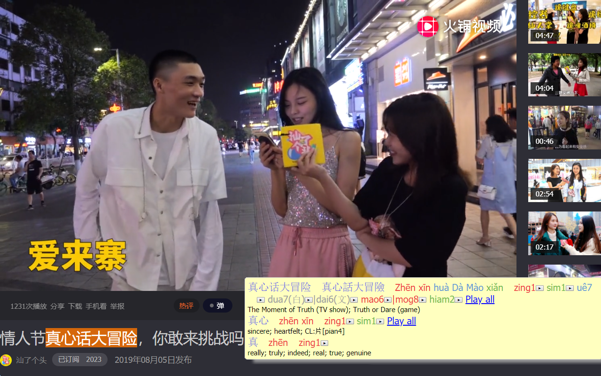

A Chrome Extension that displays the Mandarin and Teochew pronunciations for Chinese characters

## Screenshots

*汕了个头 is a Teochew variety show web channel based in Shantou, considered to be 
the economic capital of the Teochew region*

## What is Teochew?

[Teochew](https://en.wikipedia.org/wiki/Teochew_dialect) belongs to the 
Southern Min branch of Chinese with over 25 million speakers worldwide. 
Outside of China, it is among one of the most spoken Chinese varieties only 
surpassed by Mandarin, Cantonese, and Taiwanese/Hokkien. Phonetically, it has 
not changed very much and many vocabularies from Japanese, Korean, and 
Vietnamese that originated from China centuries ago still sound similar to 
Teochew.

For example, consider 肉 which means flesh. \[Niku\] is one of the common 
Japanese readings borrowed from China along with the character. Compare with 
Teochew \[nek8\] \([POJ spelling](https://en.wikipedia.org/wiki/Pe̍h-ōe-jī)\) 
and Mandarin \[rou4\].

## Usage

Teochew Pop-up Dictionary is based on [Zhongwen: Chinese-English 
Dictionary](https://chrome.google.com/webstore/detail/zhongwen-chinese-english/kkmlkkjojmombglmlpbpapmhcaljjkde) 
(v. 5.4.3) by Christian Schiller. For non-Teochew usage info (like useful 
keyboard shortcuts), please refer to his page or the in-extension help. 
If Teochew functionality isn't needed at all, please directly use 
Zhongwen for Mandarin learning instead.

Press the \[潮\] button to enable the extension and bring up the mini-help menu. 
Mouse over Chinese to bring up the entry in a pop-up.

### Layout

Each entry shows Simplified Chinese and then Traditional Chinese, if the 
characters are different, and then the Pinyin and Teochew Romanization 
with the definition underneath. The layout, including omitting the Pinyin, 
can be customized on the options page.

### Teochew Romanization: Peng'im

While Pinyin is the most universally accepted Romanization system for 
Mandarin, the same level of acceptance has not been attained for Teochew, 
resulting in inconsistent spellings when speakers discuss phoneticization, 
even for native speakers in China. On the other hand, professional Teochew 
linguists and Teochew-Chinese dictionaries use the government backed 
[Peng'im](https://en.wikipedia.org/wiki/Peng%27im) system, which is the 
most Pinyin-like compared to other Southern Min Romanization systems.

Given that most users will not be initially familiar with Peng'im, every 
Teochew syllable also has a playable pronunciation. 

## Legal

This program is free software; you can redistribute it and/or
modify it under the terms of the GNU General Public License
as published by the Free Software Foundation; either version 2
of the License, or (at your option) any later version.

This program is distributed in the hope that it will be useful,
but WITHOUT ANY WARRANTY; without even the implied warranty of
MERCHANTABILITY or FITNESS FOR A PARTICULAR PURPOSE.  See the
GNU General Public License for more details.

You should have received a copy of the GNU General Public License
along with this program; if not, write to the Free Software
Foundation, Inc., 51 Franklin Street, Fifth Floor, Boston, MA  02110-1301, USA.

Teochew Pop-up Dictionary
Copyright (C) 2019 Paul La